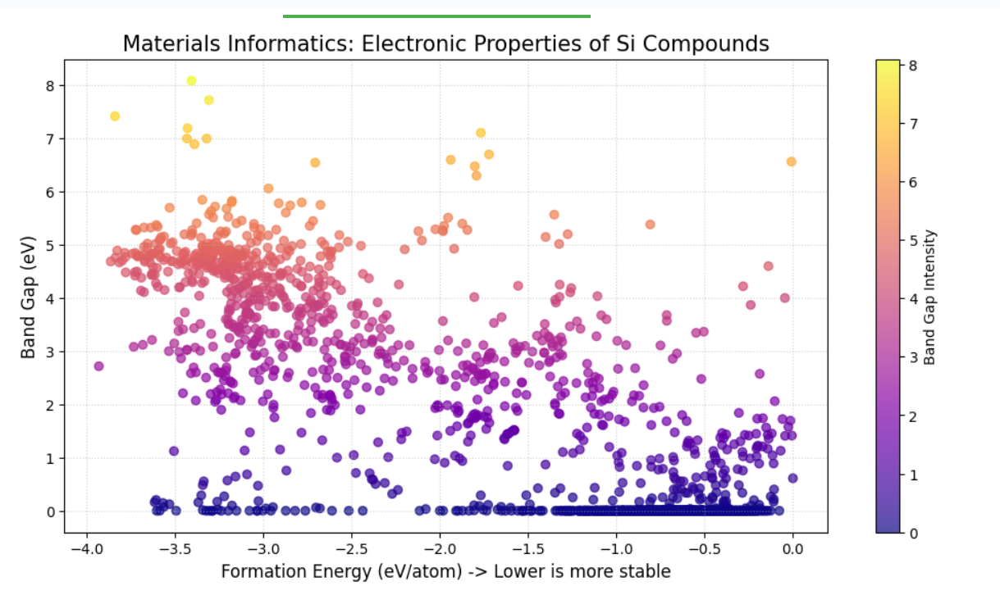

# Materials-Informatics-Analysis
predicting semiconductor properties using python and machine learning 
| Silicon Compound Stability | Scientific Analysis |
| :--- | :--- |
|  | **Materials:** Si-based compounds   **Total Data Points:** 2,500+   **Key Insight:** Stable semiconductors (Pink/Orange) are found between -3 and -4 eV/atom. |
| Silicon Stability Plot | Physical Interpretation |
